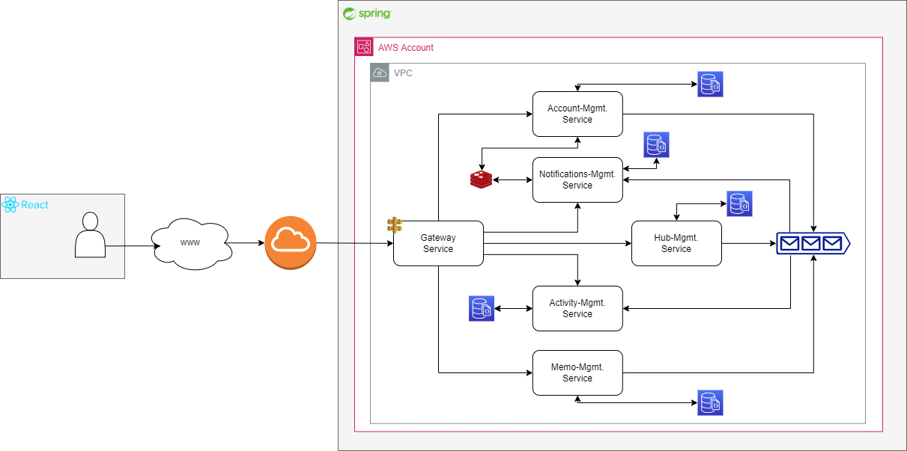

# Alkalmazás specifikáció

## Alapötlet

Tudásmegosztásra kihelyezett közösségi munkaplatform a vállalati/egyéb közösségen belüli gyors információmegosztásra és megőrzésre rövid memo-k formájában, ahol bárki könnyedén megoszthatja aktuális gondolatait/felhívásait/közléseit egy adott tematikáról vagy gondolatról csoportokon belül, amelyeket mások teljesíthetnek és elvégzésüket kvázi kötelezővé tehetik határidők megadásával, amelyekre a felhasználók értesítést kapnak sok más egyéb mellett.

Kiindulási alap a következő már "piacon" levő open-source kezdeményezés, amely `Go`-ban került implementálásra [GitHub/usememos](https://github.com/usememos/memos). De akár hasonló valamelyest a Slack és a Teams is.

## Funkcionalitások

### Kollaboratív és stratégiai megfontolások

Az alkalmazás elvárt alapvető funkcionalitásai:

- Felhasználók képesek saját contókat létrehozni a platformhoz való csatlakozáshoz,
- Felhasználók képesek közösségekhez, ún. hub-okhoz csatlakozási kéréseket leadni és adminisztrátor (hub tulajdonos) felhasználók ezeket elfogadni vagy elutasítani,
- Felhasználók képesek saját hub-okat létrehozni, tetszőleges névvel és leírással,
- Felhasználók képesek memo-kat megosztani különböző láthatósági szintekkel kizárólag a hub-on belül: publikus vagy privát (csak a publikáló felhasználó által megtekinthető memo),
  - Ezek a memo-k tartalmazhatnak tetszőleges dolgokat akár képeket (külső forrásból), emojikat, akár `Markdown`-t, stb. (jelenleg scope-n kívül esik, hogy akár fájlfeltöltést is támogassunk).
- Aznapi vagy bármikori memo-k tetszőleges megtekintése közel valós időben, alapesetben a felhasználónak kilistázza az éppen aktuális memo-kat prioritásuk és publikálási dátumuk szerint rendezve:
  - A memo-kat lehetőség van különböző szempontok szerint rendezni, pl. publikálási dátum, prioritás, stb.
  - A memo-kat képesek a tulajdonos vagy az azt létrehozó felhasználók módosítani, archívumba helyezve, vagy kitűzni a hub falára.
- A felhasználók képesek a memo-k között keresni cím alapján, láthatóság és prioritási szintek alapján,
- Folyamatosan valósidőben karbantartott "online" státusz az aktív felhasználókhoz (hub-on belül és kívül (értelemszerűen a főoldalon)),
- Aktivitási hőtérkép és interakciós (milyen tevékenységek végződtek el a múltban) listázás az aktuális hétre vetítve informatív jelleggel,
- Azon felhasználók, amelyek tagjai az adott hub-nak visszajelzést adhatnak a memo-kra teljesítési kitűzőkkel,
- Értesítési mechanizmus a platformon történő eseményekre, pl. új memo, reakciók saját memo-kra, teljesítés, emlékeztető a határidővel ellátott memo teljesítésére, stb.
- A felhasználók képesek összegzés formájában megtekinteni az összes hub-jukat, informálódni arról, hogy hány új memo van, hány aktív tag, stb.

### Kiegészítő funkcionalitások

Kiegészítő, technológiai (az alap use-case-n kívül eső, általában technikai) funkcionalitások:

- Kubernetes kitelepítés (`K8S és Helm Chart`),
- Alkalmazás cluster (`K8S`) automatizált létrehozása (`Terraform`),
- Cloud platform kitelepítés (`DigitalOcean`),
- `MongoDB és Apache Kafka` skálázható (és redundáns) kitelepítései,
- `Redis`, mint cache-lési megoldás skálázható kitelepítése,
- `GitLab CI/CD` automatizáció.

## Komponensdiagram

### Diagram-magyarázat

1. Gateway-service

> A szolgáltatási réteg egyetlen belépési pontja, minden platformbéli interakció ezen keresztül érhető el, általános `routing` szerepkör; közvetíti a bejövő kérést a megfelelő belső micro-service-hez, miközben a felhasználónak egyetlen külső pontot definiálunk;  
> Kiegészítő a valós idejű megvalósításhoz, hogy a különböző csatorna-routing-ot is ez a service fogja végezni (jön egy kérés egy adott `WebSocket` csatorna eléréséhez, akkor ez fogja továbbítani a releváns service-hez). Példaképpen egy ilyen funkcionalitás az online státusz: Redis-ben lehet tárolni az aktív felhasználókat (`Account Mgmt.` által kezelve), amint változik ez a lista (aminek minden bemenetének van egy adott aktivitási lejártja) az üzenet publikálásra kerül a releváns `WebSocket`-re ahhoz, hogy a felhasználó megjelenített aktív felhasználó listája frissüljön valós időben;  
> További funkcionalitás a biztonsági réteg megvalósítása, hiszen ez a micro-service nem fogja a védett útvonalakra beengedni a kérést, amennyiben nem rendelkezik a megfelelő token-nel.  

2. Account-Mgmt. service

> Feladata felhasználók kezelése és azok létrehozása, valamint kiállítja a megfelelő authorizációs tokeneket belépéskor és regisztrációkor,  
> Karbantartja a listát az aktív felhasználókkal, folyamatosan publish-olva üzeneteket a megfelelő `WebSocket` csatornákra,  

3. Hub-Mgmt. service

> Feladata a hub-ok kezelése, beleértve azok létrehozását, a csatlakozási kérelmek menedzsmentje, kilistázása, stb

4. Memo-Mgmt. service

> Feladata a memo-k kezelése, beleértve azok létrehozását, köztük való keresés megvalósítása, kilistázása, stb.

5. Activity-Notifications-Mgmt. service

> Az aktivitási hőtérkép létrehozásához feladata, hogy "elfogyassza" a platformon történő interakciókat, és azokat tárolja.  
> Értesítések kezelése, a platformon történő érdekes események közlése az éppen aktív felhasználóknak, események tárolása, amennyiben a felhasználók épp nem aktívak, amelyek a következő belépésükkor listázunk ki.  

Egyéb technikai hatáskör minden egyes micro-service esetében, ahol ez az eset fennáll, hogy amennyiben egyik szolgáltatás hatásköre függ a másik szolgáltatásban tárolt adatoktól, ezen adatok létrejöttét, módosulásukat és törlésüket közzé teszik a megfelelő üzenetsorra, annak érdekében, hogy redundáns módon tárolhassuk a másik szolgáltatásban és így független módon tudják saját szolgáltatásaikat nyújtani.

### Rövid technológia összefoglaló

Front-end összefoglaló:

- Nyelv: `Typescript`,
- Keretrendszer: `Next.js`,
- Komponenskönyvtár: `MaterialUI`.
- És egyéb 3rd party könyvtárak a funkcionalitásokhoz...

Back-end összefoglaló:

- NoSQL adatbázis: `MongoDB`,
- Cache megoldás: `Redis`
- Általános back-end keretrendszer: `Spring Boot` (micro-service-k implementálására, pl. `Spring JPA, Spring Repository, Spring WebFlux, háromrétegű architektúra`),
- Üzenet broker (in-cluster): `Kafka`,
- Infrastruktúra és DevOps: `Terraform` (K8S cluster létrehozása), `K8S és Helm` és `GitLab CI/CD`.

Kiegészítő egyéb technológiák: `WebSocket és Socket.IO`, `Spring Gateway`, `useSWR` adat pulling-hoz.

### Üzenetsor és valósidejűség

Több platformbéli folyamat is van amikor előtérbe kerül a valósidejűség és az üzenetsorok alkalmazása az aszinkron kommunikáció megvalósítására, de elmondhatom azt, hogy egyaránt jelen lesznek szinkron és aszinkron kommunikációs flow-k is.

Tipikus szinkron folyamatok:

- autentikáció, felhasználói bejelentkezések, stb., hiszen ekkor szükségünk a válaszra;
- memo-k létrehozása, reakciók közlése, listázás, módosítása stb.;
- hub-k létrehozása, csatlakozási kérelmek, azok elfogadása, elutasítása;
- interakciók kilistázása, hub összefoglalók kilistázása, stb.;

Aszinkron flow-k:

- **Aktív felhasználók**: `WebSocket` alapú megvalósítása, hogy minden aktív és bejelentkezett felhasználó folyamatos képet kapjon az éppen jelenlevő felhasználókról (hub-on belül és kívül).
- **Értesítések**: minden platformbéli érdekes esemény értesítés formájában közlésre kerül az éppen aktív és érintett felhasználóknak; elképzelés, hogy az ilyen események a releváns service által közlésre kerülnek egy üzenetsorban, és mivel ezek közlése egy aszinkron folyamat ezért kiolvassa a `Notifications svc.` és ugyancsak közli a megfelelő `WebSocket`-re a felhasználóknak. Minden értesítés minden érintett aktív felhasználóhoz megérkezik, aki éppen nem aktív következő bejelentkezéskor kapja azt meg.
- **Aktivitási hőtérkép**: minden platformbéli tevékenység (memo-kkal, hub-okkal kapcsolatosan) rögzítésre kerül, hogy egy általános hőtérképet jelenítsünk meg az aktivitásról (értsd. GitLab vagy GitHub-szerűen); amikor ilyen tevékenység merül fel a releváns service közli azt az üzenetsorban, amit kiolvas az `Activity Mgmt.` és karbantartja ezt a hőtérképet (értelemszerűen ennek is meglesz a megfelelő csatornája a felhasználóknak).

Kifejezetten valós idejű folyamat ezek közül az aktív felhasználók és az értesítések.